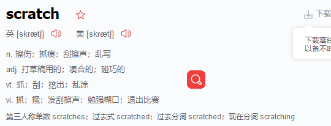
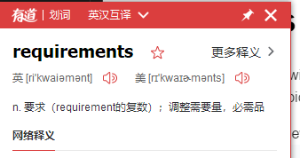
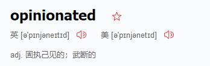
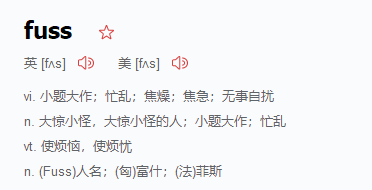
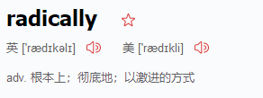
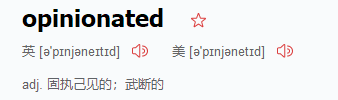
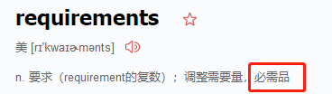
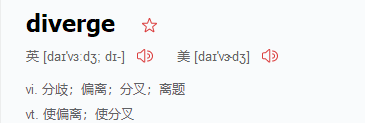

# First Steps
If you are getting started with Spring Boot or 'Spring' in general, start with the following topics(话题)

* From scratch: 
* [1.Overview](#Overview) 
* [2.Requirements](#Requirements) 
* [3.Installation](#Installation) 

* Tutorial: Part 1 | Part 2
* Running your example: Part 1 | Part 2

<h1 id="Overview">Overview</h1>
##Introducing Spring Boot
Spring Boot makes it easy to create 
stand-alone
production-grade
 Spring-based
 Applications that you can run.
 
We take an opinionated view of the Spring platform and third-party libraries,

so that you can get started with minimum fuss.

 Most Spring Boot applications need very little Spring configuration.

You can use Spring Boot to create Java applications that can be started by using java -jar or more traditional war deployments.

 We also provide a
 
command line tool
 that runs “spring scripts”.

Our primary goals are:

Provide a radically faster and widely accessible getting-started experience for all Spring development.

Be opinionated out of the box but get out of the way quickly as requirements start to diverge from the defaults.

Provide a range of non-functional features that are common to large classes of projects (such as embedded servers, security, metrics, health checks, and externalized configuration).
Absolutely no code generation and no requirement for XML configuration.
绝对没有XML配置
就是要简单暴力

<h1 id="Overview">Requirements</h1>