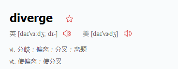

# Getting Started

If you are getting started with Spring Boot, 

or “Spring” in general, start by reading this section. 

It answers the basic “what?”, “how?” and “why?” 
questions. 

It includes an introduction to Spring Boot, along with installation instructions.

 We then walk you through building your first Spring Boot application, discussing some core principles as we go.

 

#  Introducing Spring Boot
Spring Boot makes it easy to create 
stand-alone,
production-grade 
Spring-based Applications 
that you can run.
We take an opinionated view of the Spring platform and third-party libraries,

so that you can get s`tarted with minimum fuss.

Most Spring Boot applications need very little Spring configuration.

You can use Spring Boot to create Java applications that can be started by using java -jar
or more traditional war deployments. 

We also provide a command line tool that runs “spring scripts”.

Our primary goals are:
* Provide a radically faster and widely accessible getting-started experience for all Spring development.

* Be opinionated out of the box but get out of the way quickly as requirements start to diverge from the defaults.

* Provide a range of non-functional features that are common to large classes of projects (such as embedded servers, security, metrics, health checks, and externalized configuration).

* Absolutely no code generation and no requirement for XML configuration.
绝对不要xml

