# Getting Started

If you are getting started with Spring Boot, 

or “Spring” in general, start by reading this section. 
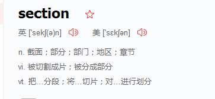

It answers the basic “what?”, “how?” and “why?” 
questions. 

It includes an introduction to Spring Boot, along with installation instructions.

 We then walk you through building your first Spring Boot application, discussing some core principles as we go.

 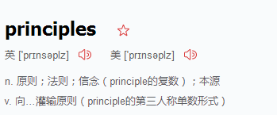

#  Introducing Spring Boot
Spring Boot makes it easy to create 
stand-alone,
production-grade 
Spring-based Applications 
that you can run.
We take an opinionated view of the Spring platform and third-party libraries,

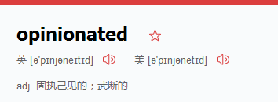

so that you can get s`tarted with minimum fuss.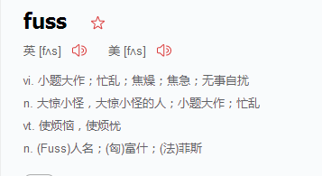

Most Spring Boot applications need very little Spring configuration.

You can use Spring Boot to create Java applications that can be started by using java -jar
or more traditional war deployments. 

We also provide a command line tool that runs “spring scripts”.

Our primary goals are:
* Provide a radically faster and widely accessible getting-started experience for all Spring development.
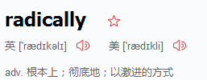
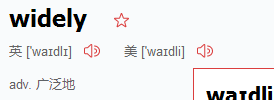

* Be opinionated out of the box but get out of the way quickly as requirements start to diverge from the defaults.
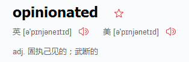
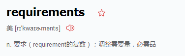
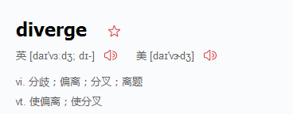

* Provide a range of non-functional features that are common to large classes of projects (such as embedded servers, security, metrics, health checks, and externalized configuration).
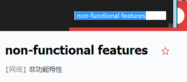


* Absolutely no code generation and no requirement for XML configuration.
绝对不要xml

# System Requirements
系统要求
Spring Boot 2.1.0.BUILD-SNAPSHOT requires 
Java 8 or 9 

and Spring Framework 5.0.5.RELEASE or above. 

Explicit build support is provided for

Maven 3.2+ 
and 
Gradle 4.

# Servlet Containers
包括的服务器
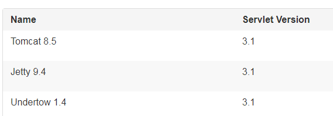

#  Installing Spring Boot
Spring Boot can be used with “classic” Java development tools or installed as a command line tool.

Either way, you need Java SDK v1.8 or higher. Before you begin, you should check your current Java installation by using the following command:
~~~
$ java -version
~~~

# installation Instructions for the Java Developer
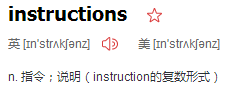

You can use Spring Boot in the same way as any standard Java library.

 To do so,
 
include the appropriate spring-boot-*.jar files on your classpath.

Spring Boot does not require any special tools integration,

so you can use any IDE or text editor. 

Also, there is nothing special about a Spring Boot application, so you can run and debug a Spring Boot application as you would any other Java program.

Although you could copy Spring Boot jars, we generally recommend that you use a build tool that supports dependency management (such as Maven or Gradle).
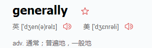
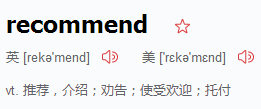

# Maven Installation
Spring Boot is compatible 
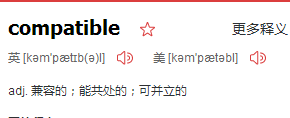 Apache Maven 3.2 or above. If you do not already have Maven installed,you can follow the instructions at maven.apache.org.


Spring Boot dependencies use the org.springframework.boot groupId. Typically,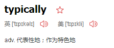 your Maven POM file inherits from the spring-boot-starter-parent project and declares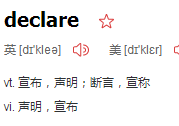 dependencies to one or more “Starters”.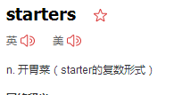 Spring Boot also provides an optional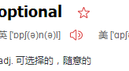 Maven plugin to create executable jars.

The following listing shows a typical pom.xml file:
 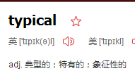
```
<?xml version="1.0" encoding="UTF-8"?>
<project xmlns="http://maven.apache.org/POM/4.0.0" xmlns:xsi="http://www.w3.org/2001/XMLSchema-instance"
	xsi:schemaLocation="http://maven.apache.org/POM/4.0.0 http://maven.apache.org/xsd/maven-4.0.0.xsd">
	<modelVersion>4.0.0</modelVersion>

	<groupId>com.example</groupId>
	<artifactId>myproject</artifactId>
	<version>0.0.1-SNAPSHOT</version>

	<!-- Inherit defaults from Spring Boot -->
	<parent>
		<groupId>org.springframework.boot</groupId>
		<artifactId>spring-boot-starter-parent</artifactId>
		<version>2.1.0.BUILD-SNAPSHOT</version>
	</parent>

	<!-- Add typical dependencies for a web application -->
	<dependencies>
		<dependency>
			<groupId>org.springframework.boot</groupId>
			<artifactId>spring-boot-starter-web</artifactId>
		</dependency>
	</dependencies>

	<!-- Package as an executable jar -->
	<build>
		<plugins>
			<plugin>
				<groupId>org.springframework.boot</groupId>
				<artifactId>spring-boot-maven-plugin</artifactId>
			</plugin>
		</plugins>
	</build>

	<!-- Add Spring repositories -->
	<!-- (you don't need this if you are using a .RELEASE version) -->
	<repositories>
		<repository>
			<id>spring-snapshots</id>
			<url>https://repo.spring.io/snapshot</url>
			<snapshots><enabled>true</enabled></snapshots>
		</repository>
		<repository>
			<id>spring-milestones</id>
			<url>https://repo.spring.io/milestone</url>
		</repository>
	</repositories>
	<pluginRepositories>
		<pluginRepository>
			<id>spring-snapshots</id>
			<url>https://repo.spring.io/snapshot</url>
		</pluginRepository>
		<pluginRepository>
			<id>spring-milestones</id>
			<url>https://repo.spring.io/milestone</url>
		</pluginRepository>
	</pluginRepositories>
</project>
```
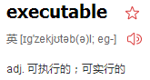

# Quick-start Spring CLI Example
~~~
@RestController
class ThisWillActuallyRun {

	@RequestMapping("/")
	String home() {
		"Hello World!"
	}

}
~~~
Then run it from a shell, as follows:
~~~
spring run app.groovy
~~~
Open localhost:8080 in your favorite web browser. You should see the following output:
~~~
Hello World!
~~~

#  Adding Classpath Dependencies
Spring Boot provides a number of “Starters” 
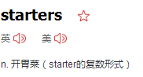that let you add jars to your classpath. Our sample application has already used spring-boot-starter-parent in the parent section of the POM. The spring-boot-starter-parent is a special starter that provides useful Maven defaults. It also provides a dependency-management section 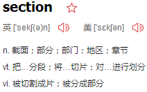so that you can omit 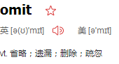version tags for “blessed” dependencies.


Other “Starters” provide dependencies that you are likely to need when developing a specific type of application. Since we are developing a web application, we add a spring-boot-starter-web dependency. Before that, we can look at what we currently have by running the following command:
~~~
$ mvn dependency:tree

[INFO] com.example:myproject:jar:0.0.1-SNAPSHOT
~~~

The mvn dependency:tree command prints a tree representation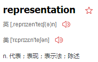 of your project dependencies. You can see that spring-boot-starter-parent provides no dependencies by itself. To add the necessary dependencies, edit your pom.xml and add the spring-boot-starter-web dependency immediately below the parent section: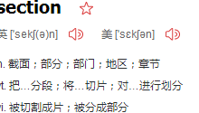
~~~
<dependencies>
	<dependency>
		<groupId>org.springframework.boot</groupId>
		<artifactId>spring-boot-starter-web</artifactId>
	</dependency>
</dependencies>
~~~
If you run mvn dependency:tree again, you see that there are now a number of additional dependencies, including the Tomcat web server and Spring Boot itself.

#  Writing the Code
To finish our application, we need to create a single Java file. By default, Maven compiles sources from src/main/java, so you need to create that folder structure and then add a file named src/main/java/Example.java to contain the following code:
~~~
import org.springframework.boot.*;
import org.springframework.boot.autoconfigure.*;
import org.springframework.web.bind.annotation.*;

@RestController
@EnableAutoConfiguration
public class Example {

	@RequestMapping("/")
	String home() {
		return "Hello World!";
	}

	public static void main(String[] args) throws Exception {
		SpringApplication.run(Example.class, args);
	}

}
~~~

Although there is not much code here, quite a lot is going on. We step through 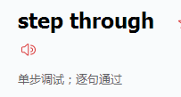the important parts in the next few sections.
#  The @RestController and @RequestMapping Annotations

The first annotation on our Example class is @RestController. This is known as a stereotype 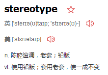annotation. It provides hints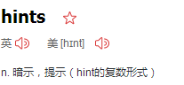 for people reading the code and for Spring that the class plays a specific role. In this case, our class is a web @Controller, so Spring considers it when handling 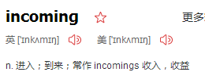 web requests.

The @RequestMapping annotation provides “routing” information. It tells Spring that any HTTP request with the / path should be mapped to the home method. The @RestController annotation tells Spring to render the resulting string directly back to the caller.

# The @EnableAutoConfiguration Annotation

The second class-level annotation is @EnableAutoConfiguration. This annotation tells Spring Boot to “guess” how you want to configure Spring, based on the jar dependencies that you have added. Since spring-boot-starter-web added Tomcat and Spring MVC, the auto-configuration 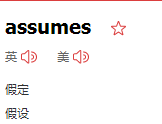 that you are developing a web application and sets up Spring accordingly.

# The “main” Method
The final part of our application is the main method. This is just a standard method that follows the Java 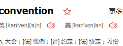 for an application entry point. Our main method 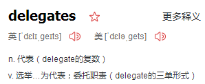 to Spring Boot’s SpringApplication class by calling run. SpringApplication bootstraps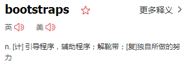 our application, starting Spring, which, in turn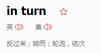, starts the auto-configured Tomcat web server. We need to pass Example.class as an argument to the run method to tell SpringApplication which is the primary Spring component. The args array is also passed through to expose 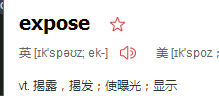any command-line arguments.