# Working with Spring Boot
Ready to actually start using Spring Boot? We have you covered:

* Build systems: Maven | Gradle | Ant | Starters

* Best practices: 
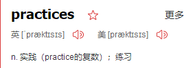
Code Structure 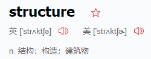| @Configuration | @EnableAutoConfiguration | Beans and Dependency Injection
* Running your code IDE | Packaged | Maven | Gradle
* Packaging your app: Production jars
* Spring Boot CLI: Using the CLI

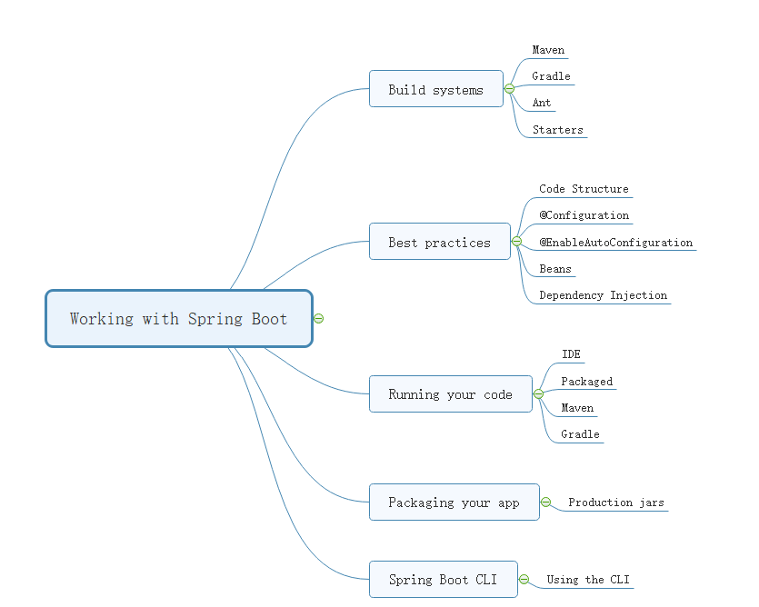


# Using Spring Boot
This section goes into more detail about how you should use Spring Boot. 
It covers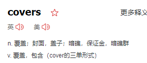 topics such as build systems, auto-configuration, and how to run your applications. We also cover some Spring Boot best practices. Although there is nothing particularly special about Spring Boot (it is just another library that you can consume), there are a few recommendations that, when followed, make your development process a little easier.

## Build Systems
### Dependency Management
Each release of Spring Boot provides a curated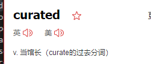 list of dependencies that it supports. In practice, you do not need to provide a version for any of these dependencies in your build configuration, as Spring Boot manages that for you. When you upgrade Spring Boot itself, these dependencies are upgraded as well in a consistent way.

The curated list contains all the spring modules that you can use with Spring Boot as well as a refined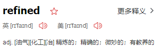 list of third party libraries. The list is available as a standard Bills of Materials (spring-boot-dependencies) that can be used with both Maven and Gradle.

#### Maven
Maven users can inherit from the spring-boot-starter-parent project to obtain 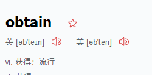sensible 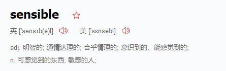defaults. The parent project provides the following features:
```
Java 1.8 as the default compiler level.
UTF-8 source encoding.
A Dependency Management section, inherited from the spring-boot-dependencies pom, that manages the versions of common dependencies. This dependency management lets you omit <version> tags for those dependencies when used in your own pom.
Sensible resource filtering.
Sensible plugin configuration (exec plugin, Git commit ID, and shade).
Sensible resource filtering for application.properties and application.yml including profile-specific files (for example, application-dev.properties and application-dev.yml)
```

#### Inheriting the Starter Parent
~~~
<!-- Inherit defaults from Spring Boot -->
<parent>
	<groupId>org.springframework.boot</groupId>
	<artifactId>spring-boot-starter-parent</artifactId>
	<version>2.1.0.BUILD-SNAPSHOT</version>
</parent>
~~~
#### Using Spring Boot without the Parent POM
Not everyone likes inheriting from the spring-boot-starter-parent POM. You may have your own corporate 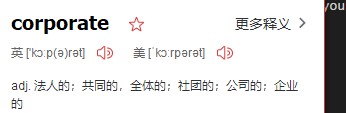standard parent that you need to use or you may prefer to explicitly declare all your Maven configuration.

If you do not want to use the spring-boot-starter-parent, you can still keep the benefit of the dependency management (but not the plugin management) by using a scope=import dependency, as follows:
~~~
<dependencyManagement>
		<dependencies>
		<dependency>
			<!-- Import dependency management from Spring Boot -->
			<groupId>org.springframework.boot</groupId>
			<artifactId>spring-boot-dependencies</artifactId>
			<version>2.1.0.BUILD-SNAPSHOT</version>
			<type>pom</type>
			<scope>import</scope>
		</dependency>
	</dependencies>
</dependencyManagement>
~~~

The preceding sample setup does not let you override individual dependencies by using a property, as explained above. To achieve the same result, you need to add an entry in the dependencyManagement of your project before the spring-boot-dependencies entry. For instance, to upgrade to another Spring Data release train, you could add the following element to your pom.xml:

~~~
<dependencyManagement>
	<dependencies>
		<!-- Override Spring Data release train provided by Spring Boot -->
		<dependency>
			<groupId>org.springframework.data</groupId>
			<artifactId>spring-data-releasetrain</artifactId>
			<version>Fowler-SR2</version>
			<type>pom</type>
			<scope>import</scope>
		</dependency>
		<dependency>
			<groupId>org.springframework.boot</groupId>
			<artifactId>spring-boot-dependencies</artifactId>
			<version>2.1.0.BUILD-SNAPSHOT</version>
			<type>pom</type>
			<scope>import</scope>
		</dependency>
	</dependencies>
</dependencyManagement>
~~~

#### Using the Spring Boot Maven Plugin
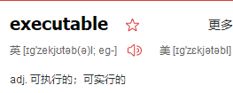
Spring Boot includes a Maven plugin that can package the project as an executable jar. Add the plugin to your <plugins> section if you want to use it, as shown in the following example:
~~~
<build>
	<plugins>
		<plugin>
			<groupId>org.springframework.boot</groupId>
			<artifactId>spring-boot-maven-plugin</artifactId>
		</plugin>
	</plugins>
</build>
~~~

# Structuring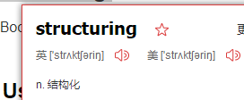 Your Code
Spring Boot does not require any specific code layout to work. However, there are some best practices that help.

## 1Using the “default” Package
When a class does not include a package declaration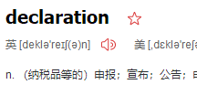, it is considered to be in the “default package”. The use of the “default package” is generally discouraged and should be avoided. It can cause particular problems for Spring Boot applications that use the @ComponentScan, @EntityScan, or @SpringBootApplication annotations, since every class from every jar is read.
## 2Locating the Main Application Class
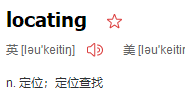
We generally recommend that you locate your main application class in a root package above other classes. 

The @SpringBootApplication annotation is often placed on your main class,

and it implicitly defines a base “search package” for certain items. For example, if you are writing a JPA application, the package of the @SpringBootApplication annotated class is used to search for @Entity items. Using a root package also allows component scan to apply only on your project.
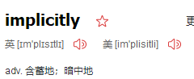

The following listing shows a typical layout:
```
com
 +- example
     +- myapplication
         +- Application.java
         |
         +- customer
         |   +- Customer.java
         |   +- CustomerController.java
         |   +- CustomerService.java
         |   +- CustomerRepository.java
         |
         +- order
             +- Order.java
             +- OrderController.java
             +- OrderService.java
             +- OrderRepository.java
```

The Application.java file would declare the main method, along with the basic @SpringBootApplication, as follows:
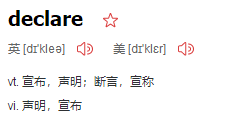


~~~
package com.example.myapplication;

import org.springframework.boot.SpringApplication;
import org.springframework.boot.autoconfigure.SpringBootApplication;

@SpringBootApplication
public class Application {

	public static void main(String[] args) {
		SpringApplication.run(Application.class, args);
	}

}
~~~

# Configuration Classes
Spring Boot favors Java-based configuration.

 Although it is possible to use SpringApplication with XML sources, we generally recommend that your primary source be a single @Configuration class. 
 
 Usually the class that defines the main method is a good candidate as the primary @Configuration.
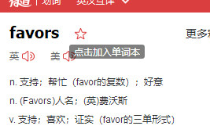
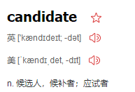

#  Auto-configuration

Spring Boot auto-configuration attempts to automatically configure your Spring application based on the jar dependencies that you have added. 
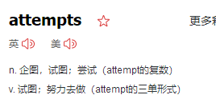

For example, if HSQLDB is on your classpath, and you have not manually configured any database connection beans, then Spring Boot auto-configures an in-memory database.


You need to opt-in to auto-configuration by adding the @EnableAutoConfiguration or @SpringBootApplication annotations to one of your @Configuration classes.


## 1 Gradually Replacing Auto-configuration
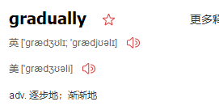

Auto-configuration is non-invasive. At any point, you can start to define your own configuration to replace specific parts of the auto-configuration. 
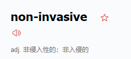

For example, if you add your own DataSource bean, the default embedded database support backs away.


If you need to find out what auto-configuration is currently being applied, and why, start your application with the --debug switch. Doing so enables debug logs for a selection of core loggers and logs a conditions report to the console.


Disabling Specific Auto-configuration Classes

If you find that specific auto-configuration classes that you do not want are being applied, you can use the exclude attribute of @EnableAutoConfiguration to disable them, as shown in the following example:

~~~

importorg.springframework.boot.autoconfigure.*;
importorg.springframework.boot.autoconfigure.jdbc.*;
importorg.springframework.context.annotation.*;

@Configuration
@EnableAutoConfiguration(exclude={DataSourceAutoConfiguration.class})
public class MyConfiguration 
{
}
~~~
If the class is not on the classpath, you can use the excludeName attribute of the annotation and specify the fully qualified name instead. Finally, you can also control the list of auto-configuration classes to exclude by using the spring.autoconfigure.exclude property.


Spring Beans and Dependency Injection


You are free to use any of the standard Spring Framework techniques to define your beans and their injected dependencies. 
For simplicity, we often find that using @ComponentScan (to find your beans) 
and using @Autowired 
(to do constructor injection) works well.

If you structure your code as suggested above (locating your application class in a root package), you can add @ComponentScan without any arguments. 

All of your application components (@Component, @Service, @Repository, @Controller etc.) are automatically registered as Spring Beans.


The following example shows a @Service Bean that uses constructor injection to obtain a required RiskAssessor bean:
```
package com.example.service;

import org.springframework.beans.factory.annotation.Autowired;
import org.springframework.stereotype.Service;

@Service
public class DatabaseAccountService implements AccountService {

	private final RiskAssessor riskAssessor;

	@Autowired
	public DatabaseAccountService(RiskAssessor riskAssessor) {
		this.riskAssessor = riskAssessor;
	}

	// ...

}
```

If a bean has one constructor, you can omit the @Autowired, as shown in the following example:


```
@Service
public class DatabaseAccountService implements AccountService {

	private final RiskAssessor riskAssessor;

	public DatabaseAccountService(RiskAssessor riskAssessor) {
		this.riskAssessor = riskAssessor;
	}

	// ...

}
```

Using the @SpringBootApplication Annotation

Many Spring Boot developers like their apps to use auto-configuration, component scan and be able to define extra configuration on their "application class".
 A single @SpringBootApplication annotation can be used to enable those tree features, that is:

*   `@EnableAutoConfiguration`: enable [Spring Boot’s auto-configuration mechanism](https://docs.spring.io/spring-boot/docs/current-SNAPSHOT/reference/htmlsingle/#using-boot-auto-configuration "16. Auto-configuration")


*   `@ComponentScan`: enable `@Component` scan on the package where the application is located (see [the best practices](https://docs.spring.io/spring-boot/docs/current-SNAPSHOT/reference/htmlsingle/#using-boot-structuring-your-code "14. Structuring Your Code"))

*   `@Configuration`: allow to register extra beans in the context or import additional configuration classes

The @SpringBootApplication annotation is equivalent to using @Configuration, @EnableAutoConfiguration, and @ComponentScan with their default attributes, as shown in the following example:


```
package com.example.myapplication;

import org.springframework.boot.SpringApplication;
import org.springframework.boot.autoconfigure.SpringBootApplication;

@SpringBootApplication // same as @Configuration @EnableAutoConfiguration @ComponentScan
public class Application {

	public static void main(String[] args) {
		SpringApplication.run(Application.class, args);
	}

}
```

Running Your Application

One of the biggest advantages of packaging your application as a jar and using an embedded HTTP server is that you can run your application as you would any other. Debugging Spring Boot applications is also easy. You do not need any special IDE plugins or extensions.


Developer Tools

Spring Boot includes an additional set of tools that can make the application development experience a little more pleasant. 


The spring-boot-devtools module can be included in any project to provide additional development-time features. To include devtools support, add the module dependency to your build, as shown in the following listings for Maven and Gradle:
Maven. 
```
<dependencies>
	<dependency>
		<groupId>org.springframework.boot</groupId>
		<artifactId>spring-boot-devtools</artifactId>
		<optional>true</optional>
	</dependency>
</dependencies>

```


